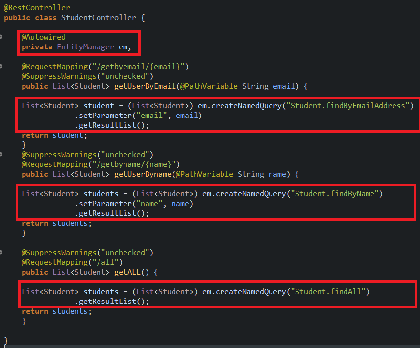

# NamedQueryExample
Example of the use of @NamedQuery

In this example, a database ("example_mysql") is created based on Msql

The fundamental classes are

<ul>
<li>Student</li>
<li>StudentInterface</li>
<li>DataLoader</li>
<li>StudentController</li>
</ul>

The Student class is in charge of representing the model

The StudentInterface is in charge of create the JPA repository

The DataLoader class is in charge of populating the BD

TheStudentController class is in charge of bring the rest endpoints

Three named queries are defined in the model class

<ul>
<li>@NamedQuery(name = "Student.findByEmailAddress", query = "select u from Student u where u.email = :email")</li>
<li>@NamedQuery(name = "Student.findByName", query = "select u from Student u where u.name = :name")</li>
<li>@NamedQuery(name = "Student.findAll", query = "SELECT u FROM Student u")</li>
</ul>

These named query are used in the controller class (StudentController)

